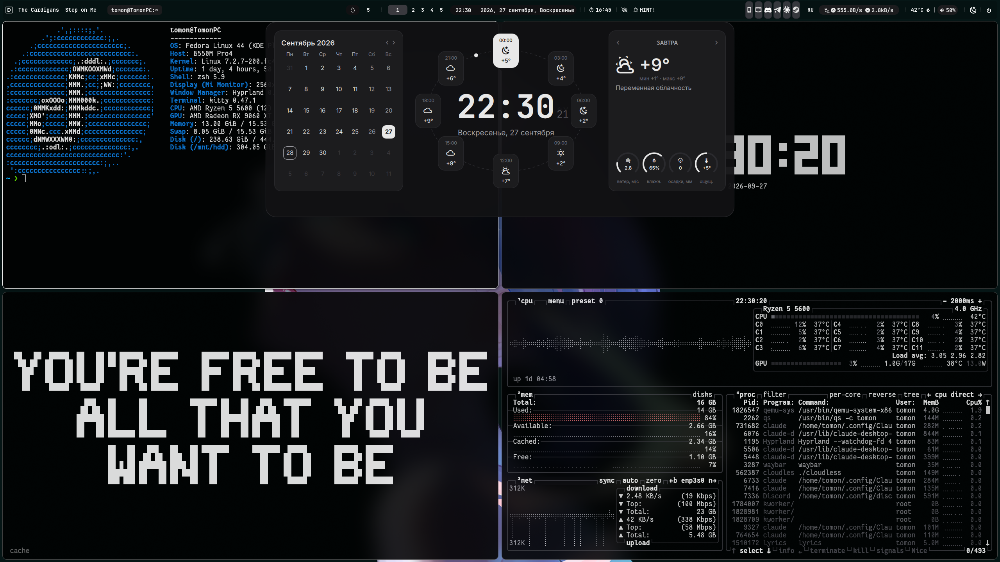
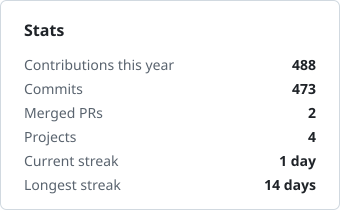
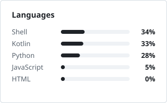
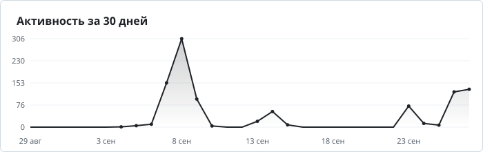

  

  
  
  
  
  
  

---

### About

- When something I need is missing, or the existing tools don't suit me, I just write my own. That's how **cloudless**, **[byway](https://github.com/tomon-one/byway)** and **[Kogda Para?](https://github.com/tomon-one/kogda-para)** came to be
- Studying to be a system administrator
- My PC is mostly for music and work
- Monochrome, minimalism, and everything tuned to the last pixel

### Now

- **[Kogda Para?](https://github.com/tomon-one/kogda-para/releases)** 1.1.0 "Baikal" is out: a day the server could not read is marked instead of a general failure, and two classes with the same number show up as both
- **[byway](https://github.com/tomon-one/byway)** 0.3.0 "Ford" is out, a big security and performance update: signed releases, keys parsed 10 times faster
- **[claude-desktop-presence](https://github.com/tomon-one/claude-desktop-presence)** is new: Discord shows what Claude Desktop is up to, with easter eggs instead of "Thinking"
- **Cloudless**, my music player, keeps growing. Linux first, as a single AppImage, Windows a bit later
- Writing about all of it in **[/dev/tomon](https://t.me/dev_tomon)** (in Russian)

### Setup

  

  Fedora 44 · Hyprland (Lua config) · custom Quickshell shell · kitty + zsh 
  Ryzen 5 5600 · RX 9060 XT · 1440p @ 200 Hz

### Activity

  <picture>
    <source media="(prefers-color-scheme: dark)" srcset="cards/stats-dark.svg">
    
  </picture>
  <picture>
    <source media="(prefers-color-scheme: dark)" srcset="cards/langs-dark.svg">
    
  </picture>

  <picture>
    <source media="(prefers-color-scheme: dark)" srcset="cards/activity-dark.svg">
    
  </picture>

  <picture>
    <source media="(prefers-color-scheme: dark)" srcset="https://raw.githubusercontent.com/tomon-one/tomon-one/output/snake-dark.svg">
    
  </picture>

 

  
  
  

